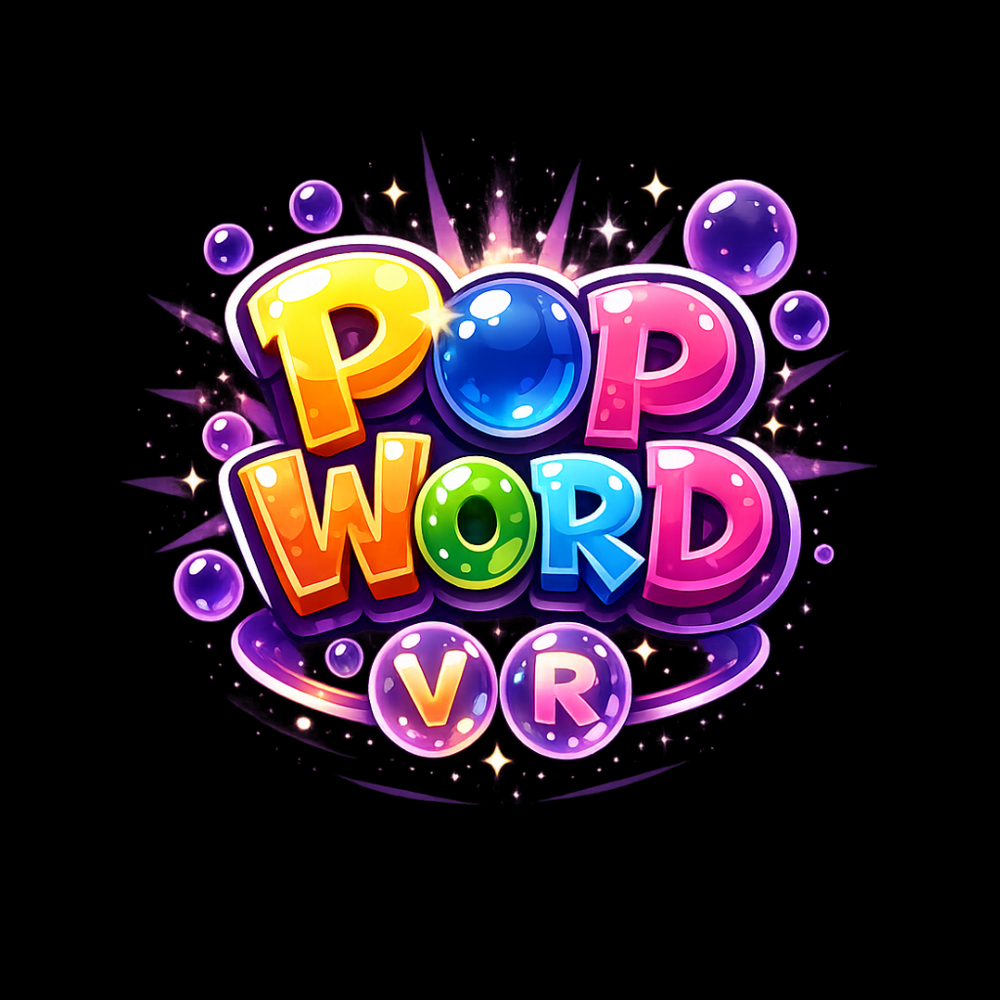

# Pop Word

<h3>Pop bubbles, spell words and master the challenge in this immersive VR puzzler!</h3>

Pop Word is a casual VR game where you have to pop the letters of a word in order before the time expires

The game combines the satisfying haptic thrill of popping bubbles with the brain-teasing challenge of word puzzles. Surrounded by a minimalist abstract aesthetic, your mission is simple but addictive: pop the floating letter-sphere in the correct order.

<h3>💡 Key Features:</h3>
<ul>
 <li> Satisfying VR Gameplay: – Use your hands (or your laser sights) to pop bubbles with precision and speed.</li>
 <li> Master the Vocabulary: – Progress through increasingly difficult words.</li>
 <li> Atmospheric Immersion: – Lose yourself in a stunning, minimalist environment inspired by the best of abstract VR aesthetics.</li>
 <li> Built for Comfort: – Play at your own pace in a seamless, stationary experience that’s perfect for all VR comfort levels.</li>
 </ul>

<a href="https://www.meta.com/experiences/vr/1234567890" target="_blank" style="
    display: inline-block;
    background-color: #00ff00;
    color: black;
    padding: 12px 24px;
    font-weight: bold;
    border-radius: 4px;
    text-decoration: none;
    font-family: monospace;
 ">
    ▶️ Play on Meta Quest Store
 </a>

📜 [Privacy Policy](PrivacyPolicy.txt)  
📧 Contact: ravensrosedev@gmail.com
